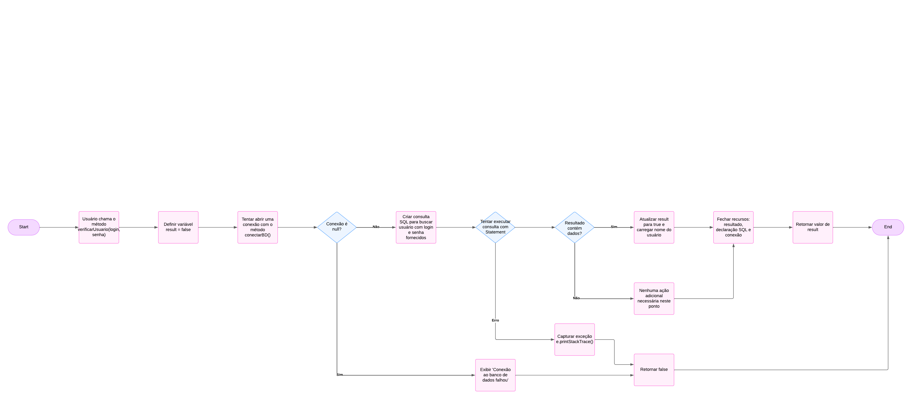

# Projeto de Login

## O que é este projeto?
Este projeto é um exemplo básico de como implementar um sistema de login utilizando Java e MySQL. Ele se conecta a um banco de dados para verificar se o nome de usuário e a senha estão corretos.

---

## Problemas encontrados no código

Durante a revisão do código, foram identificados os seguintes problemas:

1. **Segurança:**
   - **Problema:** O código está vulnerável a "SQL Injection" porque usa concatenação de strings para criar consultas SQL.
   - **Solução:** Utilizar `PreparedStatement` para proteger contra injeções.

2. **Gerenciamento de Recursos:**
   - **Problema:** As conexões com o banco de dados podem não ser fechadas corretamente em caso de erros.
   - **Solução:** Usar `try-with-resources` para garantir o fechamento automático dos recursos.

3. **Credenciais Hardcoded:**
   - **Problema:** A senha e o usuário do banco de dados estão visíveis no código.
   - **Solução:** Armazenar as credenciais em variáveis de ambiente ou em um arquivo de configuração externo.

4. **Mensagens de Erro Genéricas:**
   - **Problema:** O programa mostra mensagens genéricas, como `e.printStackTrace()`, que não são úteis para o usuário.
   - **Solução:** Implementar mensagens de erro mais claras para o usuário e adicionar logs detalhados para depuração.

---

## Como usar este projeto

1. **Configurar o Banco de Dados:**
   - Instale o MySQL e crie um banco de dados chamado `test`.
   - Crie a tabela `usuarios` e insira um usuário para teste:
     ```sql
     CREATE TABLE usuarios (
         id INT AUTO_INCREMENT PRIMARY KEY,
         login VARCHAR(50) NOT NULL,
         senha VARCHAR(50) NOT NULL,
         nome VARCHAR(100) NOT NULL
     );

     INSERT INTO usuarios (login, senha, nome) 
     VALUES ('usuarioTeste', 'senhaTeste', 'Teste User');
     ```

2. **Configurar o Ambiente:**
   - Certifique-se de que o MySQL esteja rodando.
   - Verifique as credenciais no código e ajuste se necessário.

3. **Compilar o Programa:**
   - Compile o programa no terminal:
     ```bash
     javac -cp "lib/*" src/login/User.java
     ```

4. **Executar o Programa:**
   - Execute o programa:
     ```bash
     java -cp "src:lib/*" login.User
     ```

---

## Grafo de Fluxo

O grafo abaixo representa os fluxos lógicos do método `verificarUsuario`, destacando as ações, decisões e saídas:



---

## Legenda dos Pontos Numerados

Aqui estão os principais pontos do método `verificarUsuario`:

1. **Ponto 1**: Inicializa a variável `result` como `false`.
2. **Ponto 2**: Conecta ao banco de dados chamando o método `conectarBD`.
3. **Ponto 3**: Verifica se a conexão (`conn`) é `null`.
4. **Ponto 4**: Retorna `false` se a conexão falhar.
5. **Ponto 5**: Cria a consulta SQL para buscar o usuário com login e senha.
6. **Ponto 6**: Cria um `Statement` para executar a consulta SQL.
7. **Ponto 7**: Executa a consulta SQL e obtém o `ResultSet`.
8. **Ponto 8**: Verifica se o `ResultSet` contém dados.
9. **Ponto 9**: Atualiza `result` para `true` se os dados forem encontrados.
10. **Ponto 10**: Atualiza o nome do usuário com o valor do banco.
11. **Ponto 11**: Fecha o `ResultSet`.
12. **Ponto 12**: Fecha o `Statement`.
13. **Ponto 13**: Fecha a conexão com o banco de dados.
14. **Ponto 14**: Trata exceções que podem ocorrer durante o processo.
15. **Ponto 15**: Imprime a exceção usando `e.printStackTrace()`.
16. **Ponto 16**: Retorna o valor de `result`.

---

## Caminhos Básicos

Os caminhos básicos do método `verificarUsuario` são:

1. **Caminho 1**: Start → Ponto 1 → Ponto 2 → Ponto 3 (Sim) → Ponto 4 → End.
2. **Caminho 2**: Start → Ponto 1 → Ponto 2 → Ponto 3 (Não) → Ponto 5 → Ponto 6 → Ponto 7 → Ponto 14 → Ponto 15 → End.
3. **Caminho 3**: Start → Ponto 1 → Ponto 2 → Ponto 3 (Não) → Ponto 5 → Ponto 6 → Ponto 7 → Ponto 8 (Não) → Ponto 11 → Ponto 12 → Ponto 13 → Ponto 16 → End.
4. **Caminho 4**: Start → Ponto 1 → Ponto 2 → Ponto 3 (Não) → Ponto 5 → Ponto 6 → Ponto 7 → Ponto 8 (Sim) → Ponto 9 → Ponto 10 → Ponto 11 → Ponto 12 → Ponto 13 → Ponto 16 → End.

---

## Complexidade Ciclomática

A complexidade ciclomática do método `verificarUsuario` é calculada da seguinte forma:

- **Nodos (N):** 16
- **Arestas (E):** 18
- **Componentes Conectados (P):** 1

**Fórmula:** M = E - N + 2P  
**Resultado:** M = 18 - 16 + 2(1) = **4**

A complexidade ciclomática é **4**, o que indica que existem 4 caminhos básicos no método.

---

## Documentação do Código (Javadoc)

Nesta etapa, foi gerada a documentação do código utilizando o Javadoc. Esta documentação descreve as classes, métodos e variáveis do projeto de forma detalhada, facilitando o entendimento e a manutenção do código.

### Como acessar a documentação
1. Navegue até a pasta `docs` no projeto.
2. Abra o arquivo `index.html` em um navegador.
3. Explore as páginas para entender as classes, métodos e variáveis documentadas.

### Comando utilizado para gerar o Javadoc
O comando utilizado para gerar a documentação foi:
```bash
javadoc -d docs -sourcepath src -subpackages login
